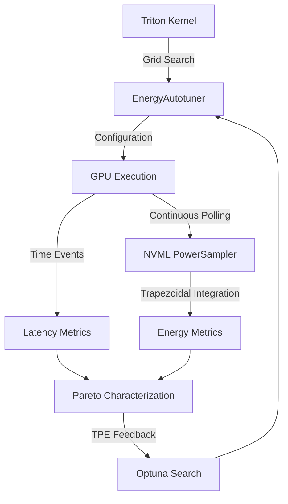

# GreenTune: Energy-Aware Autotuning for Triton-Compiled GPU Kernels


## Overview

GreenTune is an energy-aware extension to the OpenAI Triton compiler's native autotuning framework. While standard autotuners exclusively optimize for execution latency, GreenTune introduces continuous, high-frequency power sampling via NVML to simultaneously measure the latency and energy dissipation of deep learning kernels. By exposing the non-trivial Pareto frontier between speed and power, this framework demonstrates that the latency-optimal configuration for Large Language Model (LLM) primitives is rarely the energy-optimal configuration.

This repository contains the full source code, benchmarking harness, optimization search models, and the LaTeX source for the accompanying research paper.

## System Architecture

The core of GreenTune is the `EnergyAutotuner`, which wraps the standard compilation loop and dispatches an asynchronous `PowerSampler` thread during benchmarking to integrate NVML board-level power measurements.



## Key Findings

Our exhaustive grid searches over fundamental LLM kernels (Vector Addition, Fused Softmax, RMSNorm, Tiled GEMM, and Fused Causal Attention) revealed significant theoretical and empirical results:

1. **Existence of the Pareto Knee**: The latency-energy tradeoff is highly measurable. In memory-bound kernels such as RMSNorm ($4096 \times 4096$), minimizing latency requires 32 active warps, maximizing power draw. By backing off to 16 warps, GreenTune achieved substantial energy savings with a marginal impact on throughput.
2. **Warp Under-provisioning**: Across all memory-bound and elementwise kernels, the energy-optimal configuration systematically halves the number of active warps compared to the latency-optimal configuration, mitigating idle power dissipation during memory stalls.
3. **Software Pipelining**: For compute-bound kernels like FP16 Tiled GEMM, the energy optimizer heavily favors deeper software pipelining (`num_stages: 4`) over latency-focused shallow pipelining (`num_stages: 2`), ensuring smoother memory-to-register transitions that reduce peak power draw.
4. **Machine-Learning Guided Search**: Replacing the exhaustive grid sweep with a Multi-Objective Tree-structured Parzen Estimator (TPE) via Optuna successfully approximated the true Pareto frontier of a $4096^3$ GEMM kernel in a fraction of the time.

## Repository Structure

* `harness/`: Contains the core benchmarking infrastructure.
  * `energy_autotuner.py`: The drop-in replacement for `@triton.autotune`.
  * `power_sampler.py`: Asynchronous NVML polling thread.
  * `benchmark.py`: CUDA-event timed benchmarking execution loop.
* `kernels/`: Implementations of standard Triton kernels.
  * `triton/`: Vector Add, Softmax, RMSNorm, Matmul, Fused Attention.
  * `cuda/`: Reference implementations for correctness validation.
* `experiments/`: Execution scripts.
  * `run_full_sweep.py`: Triggers exhaustive grid searches across the full parameter space.
  * `run_cost_model.py`: Executes the Multi-Objective Optuna TPE search.
* `analysis/`: Visualization and data processing scripts.
  * `plot_pareto.py`: Generates Latency vs. Energy scatter plots.
  * `plot_heatmap.py`: Generates contour maps for Tiled GEMM configurations.
* `paper/`: The complete LaTeX source code and bibliography for the GreenTune research paper, formatted for IEEEtran and arXiv.

## Usage

### Prerequisites
The framework requires a Linux environment with NVIDIA drivers installed, as it relies on `pynvml` to interface directly with the hardware.

```bash
pip install torch triton pynvml pandas matplotlib seaborn optuna
```

### Running the Benchmark Suite

To execute the sanity checks and validate kernel correctness against native PyTorch:
```bash
python experiments/run_sanity_check.py
```

To run the full exhaustive parameter sweep (Warning: this may take hours depending on the GPU architecture):
```bash
python experiments/run_full_sweep.py
```

To execute the Optuna TPE multi-objective search on Tiled GEMM:
```bash
python experiments/run_cost_model.py
```

## Citation

If you use GreenTune or our empirical Pareto findings in your research, please cite our paper:

```bibtex
@misc{singh2026greentune,
  title={GreenTune: Energy-Aware Autotuning for Triton-Compiled GPU Kernels},
  author={Singh, Paramveer},
  year={2026},
  publisher={Panjab University}
}
```

## License

This project is open-source and licensed under the MIT License.
